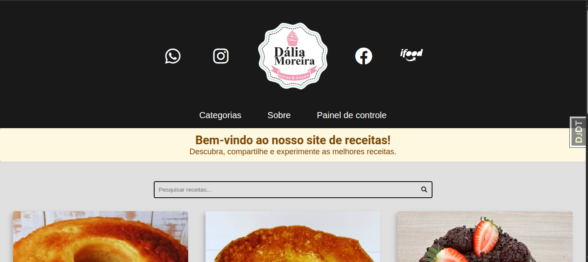
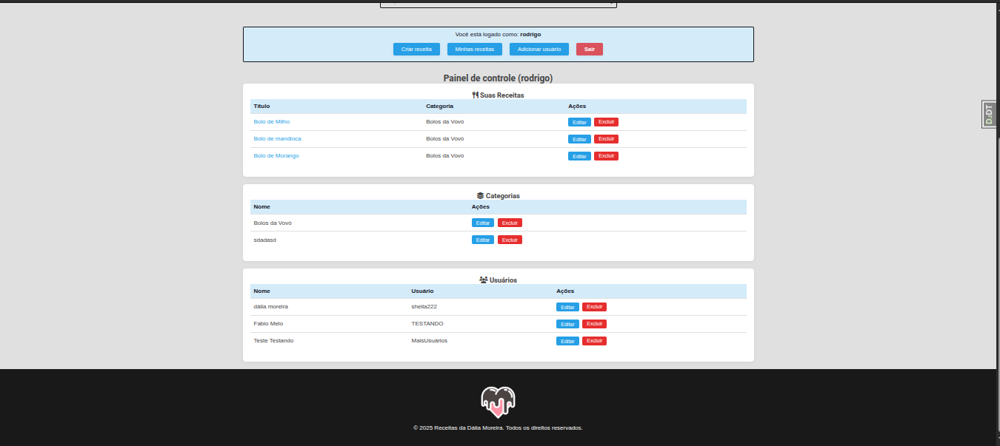
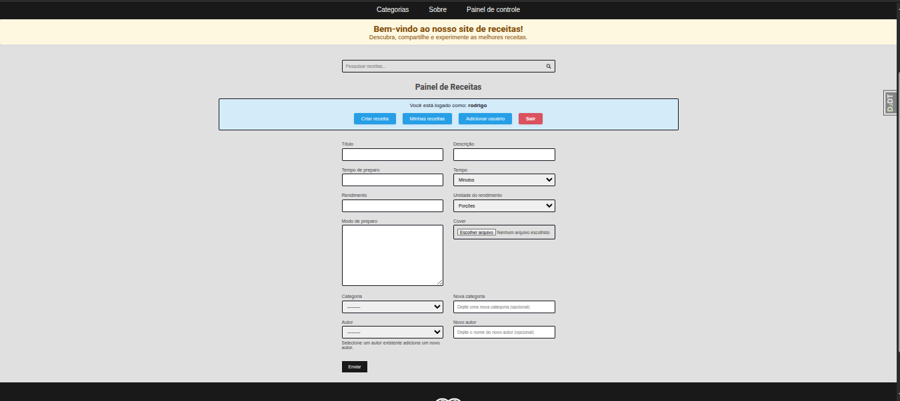
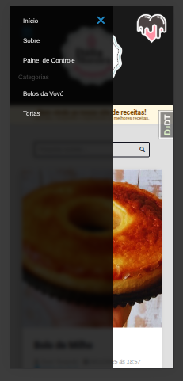
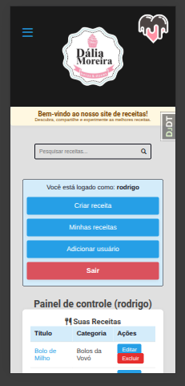
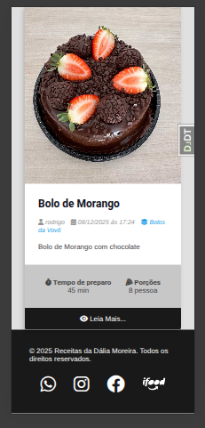

#
## Demonstração
Veja abaixo algumas telas do sistema em funcionamento:

### Desktop
<p align="center">
	
	<br>
	
	<br>
	
</p>

### Mobile
<p align="center">
	
	<br>
	
	<br>
	
</p>

---
# Receitas Confeitaria 🍰

Sistema completo para gestão de receitas, usuários e dashboard administrativo para confeitarias.


---

## Visão Geral

- **Frontend:** HTML5, CSS3, Bootstrap, responsivo e otimizado para mobile.
- **Backend:** Django 5.2, Python 3.12, REST API, autenticação JWT.
- **Testes:** Pytest, Selenium, cobertura profissional (>97%).
- **Infra:** Docker, Docker Compose, Nginx, PostgreSQL/SQLite.
- **CI/CD:** Workflows prontos para integração contínua.

---

## Funcionalidades
- Cadastro e login de usuários (admin e comum)
- CRUD de receitas, categorias e usuários
- Dashboard administrativo com permissões
- Upload de imagens
- Testes automatizados e cobertura
- Deploy fácil com Docker

---

## Instalação Rápida

```bash
# Clone o projeto
 git clone https://github.com/lordrodrigoo/Receitas-confeitaria.git
 cd Receitas-confeitaria

# Crie o .env (veja exemplo em .env.example)
 cp .env-example .env

# Suba com Docker
 docker-compose up -d --build

# Acesse: http://localhost:8000
```

---

## Testes

```bash
# Ative o venv e rode:
pytest --cov=.
# Ou com Docker:
docker-compose exec django-web pytest --cov=.
```

---

## Deploy

<p align="center">
  
</p>
<p align="center"><i>Deploy realizado com sucesso</i></p>

Veja instruções detalhadas em [deploy/README.md](deploy/README.md)

---

## Stack
- Python 3.12
- Django 5.2
- PostgreSQL/SQLite
- Docker, Nginx
- Pytest, Selenium

---


